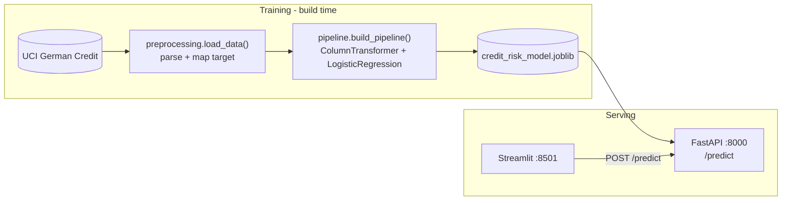
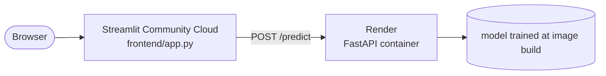

# Credit Risk Assessment System

Scores German Credit applications through a REST API, with a Streamlit front end
for interactive use. Preprocessing and classifier ship as one scikit-learn
pipeline, so the service can be handed raw application fields.


**Live Demo:** [Streamlit App](https://jorgeasmz-credit-risk-assessment.streamlit.app/)

**Live API:** [Swagger UI](https://credit-risk-assessment-6npa.onrender.com/docs)

## Architecture



The artifact is not committed. It is rebuilt by `python -m model.train`, which
the Dockerfile runs at image build time.

## Results

Stratified 80/20 split of 1,000 applications. **30% are bad credit.**

The UCI dataset ships a cost matrix, and it is the reason accuracy is the wrong
thing to optimise here: **approving an applicant who defaults costs 5, rejecting
one who would have repaid costs 1.**

| Model | Accuracy | ROC-AUC | PR-AUC | Precision | Recall | F1 | **Cost** |
|---|---:|---:|---:|---:|---:|---:|---:|
| **Logistic Regression** | 0.750 | **0.806** | **0.633** | 0.558 | 0.800 | **0.658** | **98** |
| Random Forest | 0.735 | 0.788 | 0.615 | 0.556 | 0.583 | 0.569 | 153 |
| Majority class | 0.700 | 0.500 | 0.300 | 0.000 | 0.000 | 0.000 | 300 |

Two trivial policies bound the problem: approving everyone costs 300, rejecting
everyone costs 140. **The Random Forest, at 153, is worse than rejecting every
applicant.** It has the second-highest accuracy on the table and is still not
worth deploying, which is the whole argument against reading accuracy alone.

### Decision threshold

| Threshold | Precision | Recall | Accuracy | Cost |
|---:|---:|---:|---:|---:|
| 0.30 | 0.424 | 0.883 | 0.605 | 107 |
| 0.35 | 0.447 | 0.850 | 0.640 | 108 |
| 0.40 | 0.485 | 0.833 | 0.685 | 103 |
| **0.45** | **0.521** | **0.833** | **0.720** | **96** |
| 0.50 | 0.558 | 0.800 | 0.750 | 98 |
| 0.55 | 0.568 | 0.767 | 0.755 | 105 |
| 0.60 | 0.583 | 0.700 | 0.760 | 120 |

Accuracy keeps climbing past the cost minimum: 0.60 is the most accurate row and
costs 25% more than 0.45. The service uses **0.45**. Reproduce with:

```bash
python -m evaluate
```

## Quickstart

```bash
docker compose up --build
```

- Front end: http://localhost:8501
- API docs: http://localhost:8000/docs
- Health check: http://localhost:8000/

The API container trains the model during the image build, and the front end
waits on the API health check before starting.

### Without Docker

```bash
python -m venv venv && source venv/bin/activate
pip install -r requirements.txt

python -m model.train                       # writes model/credit_risk_model.joblib
python -m app.main                          # API on :8000
streamlit run frontend/app.py               # UI on :8501, in another shell
```

The front end reads the API location from `API_URL` and defaults to
`http://localhost:8000`.

## Deployment

The two halves are hosted separately and joined by one environment variable.

| Component | Host | Built from |
|---|---|---|
| API | [Render](https://credit-risk-assessment-6npa.onrender.com/docs), Docker runtime | `Dockerfile`, declared in `render.yaml` |
| Front end | [Streamlit Community Cloud](https://jorgeasmz-credit-risk-assessment.streamlit.app/) | `frontend/app.py` |



On Streamlit Cloud the backend location goes under **Settings - Secrets**:

```toml
API_URL = "https://credit-risk-assessment-6npa.onrender.com"
```

The container binds to `$PORT` when the platform provides it and falls back to
8000 locally, so the same image runs in both places.

**Cold starts.** The free Render plan stops the container after a period of
inactivity. A measured wake-up took **32 seconds** to answer the health check,
so the front end allows 90, configurable through `API_TIMEOUT`, and reports a
timeout explicitly instead of looking broken.

The two health checks answer different questions on purpose. Render's
`healthCheckPath` only asks whether the process is alive, so `/` returns 200
even when the model failed to load; that is what keeps a bad artifact from
turning into a restart loop. Compose's healthcheck asks whether the service is
*ready* and asserts `model_loaded`, because the front end has nothing to do
until it is.

## API

| Method | Path | Purpose |
|---|---|---|
| GET | `/` | Health check; reports whether the model loaded |
| POST | `/predict` | Scores one application |
| GET | `/docs` | Swagger UI, with a worked request example |

`POST /predict` returns the risk class, a readable label and the probability of
default. Invalid payloads get a 422 from Pydantic; a missing model gets a 503.

## Development

```bash
pip install -r requirements-dev.txt

pytest              # 23 tests, 97% coverage of app/ and model/
ruff check .
```

The suite never touches the network: it fits the real pipeline on a small
synthetic frame with the same schema.

## Technical decisions

**Logistic regression, not the Random Forest.** The forest is the obvious
default and it loses here: higher cost, lower ROC-AUC, lower PR-AUC. On 800
training rows of mostly categorical data a linear model is hard to beat, and in
credit scoring its coefficients can justify a declined application, which a
forest cannot. The forest stays in `pipeline.build_forest()` as the baseline the
choice is measured against.

**The threshold is chosen by cost, not left at 0.5.** `predict()` cuts at 0.5,
which silently assumes both errors are equally expensive. They are not, and the
dataset says so explicitly, so `format_prediction` compares the probability
against a threshold picked by sweeping the cost curve.

**Preprocessing lives inside the pipeline.** Imputation, scaling and one-hot
encoding are fitted as part of the estimator, so the API can accept raw fields
and there is no second implementation of the transformations to drift out of
sync with training.

**The model directory is not mounted in Compose.** It looks harmless, but a host
mount hides the artifact the image built, and on a fresh clone that leaves the
API answering 503 to every request.

**Paths resolve from the package, not the working directory.** `MODEL_PATH` is
derived from `__file__`, so `uvicorn` behaves the same whatever directory it is
launched from.

## Project structure

```text
Credit-Risk-Assessment/
├── app/
│   ├── main.py               # FastAPI app, lifespan, endpoints
│   ├── schemas.py            # Pydantic request/response models
│   └── utils.py              # Model loading and inference
├── model/
│   ├── config.py             # Columns, feature groups, cost matrix, threshold
│   ├── preprocessing.py      # Dataset loading and target mapping
│   ├── pipeline.py           # ColumnTransformer + classifier
│   └── train.py              # Training entry point
├── frontend/app.py           # Streamlit client
├── evaluate.py               # Model comparison and cost sweep
├── tests/                    # pytest suite
├── Dockerfile                # Trains the model, serves the API
├── docker-compose.yml        # API + front end, locally
├── render.yaml               # Render Blueprint for the API service
└── ruff.toml                 # Lint rule selection
```
