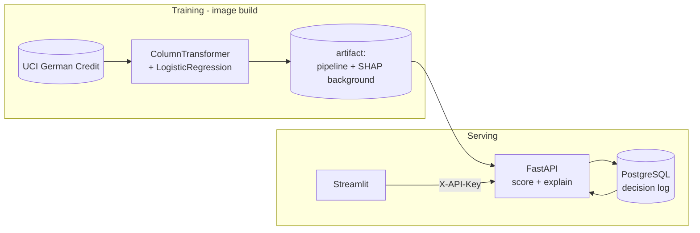

# Credit Risk Assessment System

Scores German Credit applications through a REST API that explains every
decision and keeps an auditable record of all of them, with a Streamlit front
end for interactive use.


**Live Demo:** [Streamlit App](https://jorgeasmz-credit-risk-assessment.streamlit.app/)

**Live API:** [Swagger UI](https://credit-risk-assessment-6npa.onrender.com/docs)

## Architecture



The artifact is not committed. It is rebuilt by `python -m model.train`, which
the Dockerfile runs at image build time, and it carries its own SHAP background
so the service never needs the training set to explain a prediction.

## Results

Stratified 80/20 split of 1,000 applications. **30% are bad credit.**

The UCI dataset ships a cost matrix, and it is the reason accuracy is the wrong
thing to optimise here: **approving an applicant who defaults costs 5, rejecting
one who would have repaid costs 1.**

| Model | Accuracy | ROC-AUC | PR-AUC | Precision | Recall | F1 | **Cost** |
|---|---:|---:|---:|---:|---:|---:|---:|
| **Logistic Regression** | 0.750 | **0.806** | **0.633** | 0.558 | 0.800 | **0.658** | **98** |
| Random Forest | 0.735 | 0.788 | 0.615 | 0.556 | 0.583 | 0.569 | 153 |
| Majority class | 0.700 | 0.500 | 0.300 | 0.000 | 0.000 | 0.000 | 300 |

Two trivial policies bound the problem: approving everyone costs 300, rejecting
everyone costs 140. **The Random Forest, at 153, is worse than rejecting every
applicant.** It has the second-highest accuracy on the table and is still not
worth deploying, which is the whole argument against reading accuracy alone.

Sweeping the decision threshold against the cost curve puts the optimum at
**0.45**, for a cost of **96**. Past that point accuracy keeps climbing while
cost gets worse: the most accurate threshold in the sweep costs 25% more.
Reproduce the tables with `python -m evaluate`.

## Decision explanations

A declined applicant is entitled to know why, and in several jurisdictions the
lender is obliged to say. Every response carries the per-field contribution to
the log-odds of default:

```json
{
  "decision_id": 41,
  "risk_class": 0,
  "probability": 0.081,
  "threshold": 0.45,
  "model_version": "4d17fdeb3b1d",
  "contributions": {
    "checkin_acc": 0.7749,
    "savings_acc": -0.6333,
    "credit_history": -0.6052,
    "duration": -0.3816
  }
}
```

Two things make these numbers usable rather than decorative.

**They are aggregated back onto the fields the applicant filled in.** SHAP runs
on the transformed matrix, where one categorical field occupies a column per
level, so the raw output is sixty numbers nobody can act on. The mapping is
built from the encoder's own fitted categories rather than by parsing
`get_feature_names_out()`, because names like `cat__checkin_acc_A11` cannot be
split reliably when the column name already contains underscores.

**They are reproducible.** SHAP subsamples its background by default, which
would explain the same application two different ways on two different days. The
masker is pinned to the full background instead, so a decision produced in
March explains identically in September. A test asserts the additivity property
directly: base value plus contributions equals the log-odds the model produced.

## Decision log

Every scoring is persisted with its inputs, its explanation, the threshold
applied and the **content hash of the artifact that decided**. A semantic
version would not be enough: two builds labelled `v1.2` are not necessarily the
same model, and an audit needs the file, not the label.

```
GET /decisions?limit=25&cursor=98
```

Pagination seeks on the primary key rather than using `OFFSET`, which has to
walk the rows it skips and silently shifts entries under a reader when new
decisions arrive mid-pagination.

### Outcome feedback

Cost cannot be measured without the realised outcome, so the service cannot
report what its errors cost until that outcome is recorded:

```
POST /decisions/41/outcome   {"defaulted": true}
```

`GET /summary` then prices the recorded outcomes with the same cost matrix used
to choose the model, and reports over those decisions only. It also returns the
distribution of predicted probabilities across ten buckets, which shows where
the threshold cuts the portfolio. Without recorded outcomes the service can
report the volume of rejections but not their cost.

## Quickstart

```bash
docker compose up --build
```

- Front end: http://localhost:8501
- API docs: http://localhost:8000/docs

Compose starts PostgreSQL, waits for it to become healthy, applies the
migrations and then serves. The default development key is
`local-development-key`; override it with an `API_KEY` entry in a `.env` file.

### Without Docker

```bash
python -m venv venv && source venv/bin/activate
pip install -r requirements.txt

python -m model.train              # writes model/credit_risk_model.joblib
alembic upgrade head               # creates the schema (SQLite by default)
API_KEY=dev python -m app.main     # API on :8000
API_KEY=dev streamlit run frontend/app.py
```

With no `DATABASE_URL` the service falls back to a local SQLite file, so it runs
with no infrastructure at all.

## API

| Method | Path | Auth | Purpose |
|---|---|:---:|---|
| GET | `/` | — | Health check; reports the loaded model version |
| POST | `/predict` | key | Scores one application and records the decision |
| GET | `/decisions` | key | The decision log, newest first, keyset paginated |
| GET | `/decisions/{id}` | key | Reproduces one past decision in full |
| POST | `/decisions/{id}/outcome` | key | Attaches the ground truth once the loan resolves |
| GET | `/summary` | key | Approval rate, volumes and realised cost |
| GET | `/docs` | — | Swagger UI, with a worked request example |

Authentication is a shared key in an `X-API-Key` header. **An unset key makes
the protected endpoints fail closed with 503**, never open: a scoring service
that silently serves credit decisions to anyone because a variable was missing
is a worse failure than one that stops.

## Deployment

| Component | Host | Built from |
|---|---|---|
| API + database | [Render](https://credit-risk-assessment-6npa.onrender.com/docs) | `Dockerfile`, declared in `render.yaml` |
| Front end | [Streamlit Community Cloud](https://jorgeasmz-credit-risk-assessment.streamlit.app/) | `frontend/app.py` |

`render.yaml` declares both the web service and its PostgreSQL instance, wires
the connection string in and generates the API key. Copy that key into the
Streamlit Cloud secrets alongside the backend location:

```toml
API_URL = "https://credit-risk-assessment-6npa.onrender.com"
API_KEY = "the value Render generated"
```

Platforms hand out connection strings as `postgres://` or `postgresql://`, and
SQLAlchemy maps both to psycopg2, a driver this project does not install. The
settings module rewrites them to `postgresql+psycopg://` so a deployment can
paste whatever the platform gave it.

**Cold starts.** The free Render plan stops the container after a period of
inactivity. A measured wake-up took **32 seconds** to answer the health check,
so the front end allows 90, configurable through `API_TIMEOUT`.

The two health checks answer different questions on purpose. Render's
`healthCheckPath` only asks whether the process is alive, so `/` returns 200
even when the model failed to load; that is what keeps a bad artifact from
turning into a restart loop. Compose's healthcheck asks whether the service is
*ready* and asserts `model_loaded`, because the front end has nothing to do
until it is.

## Development

```bash
pip install -r requirements-dev.txt

pytest              # 62 tests, 95% coverage of app/ and model/
ruff check .
```

The suite never touches the network or a real database: it fits the pipeline on
a small synthetic frame with the same schema, and runs against a throwaway
SQLite file. CI additionally applies the migrations to a real PostgreSQL
service, which is where a dialect difference would otherwise surface in
production rather than in a pull request.

## Technical decisions

**Logistic regression, not the Random Forest.** The forest is the obvious
default and it loses here: higher cost, lower ROC-AUC, lower PR-AUC. On 800
training rows of mostly categorical data a linear model is hard to beat, and in
credit scoring its coefficients can justify a declined application, which a
forest cannot. The forest stays in `pipeline.build_forest()` as the baseline the
choice is measured against.

**The threshold is chosen by cost, not left at 0.5.** `predict()` cuts at 0.5,
which silently assumes both errors are equally expensive. They are not, and the
dataset says so explicitly.

**Preprocessing lives inside the pipeline.** Imputation, scaling and one-hot
encoding are fitted as part of the estimator, so the API accepts raw fields and
there is no second implementation of the transformations to drift out of sync
with training.

**The model version is a content hash.** Recorded on every decision, so a
scoring can always be traced back to the exact bytes that produced it.

**Migrations own the schema.** Alembic runs at container start rather than at
image build, because the database does not exist yet when the image is built.
`create_all` would be simpler and would let the schema drift silently.

**The explainer is built once.** Constructing it costs more than using it, so it
is prepared at startup and reused, and it is pinned to the full background so
explanations stay reproducible.

## Project structure

```text
Credit-Risk-Assessment/
├── app/
│   ├── main.py               # FastAPI app, lifespan, endpoints
│   ├── schemas.py            # Pydantic request/response models
│   ├── auth.py               # API key dependency
│   ├── db.py                 # Engine, session, declarative base
│   ├── models.py             # Decision ORM model
│   ├── repository.py         # Data access and portfolio figures
│   ├── settings.py           # Environment configuration
│   └── utils.py              # Scorer: predict plus explain
├── model/
│   ├── config.py             # Columns, feature groups, cost matrix, threshold
│   ├── preprocessing.py      # Dataset loading and target mapping
│   ├── pipeline.py           # ColumnTransformer + classifier
│   ├── explain.py            # SHAP, aggregated onto the original fields
│   ├── artifact.py           # Save, load and content-hash the model
│   └── train.py              # Training entry point
├── alembic/                  # Schema migrations
├── frontend/app.py           # Streamlit client
├── evaluate.py               # Model comparison and cost sweep
├── tests/                    # pytest suite
├── Dockerfile                # Trains the model, migrates, serves the API
├── docker-compose.yml        # PostgreSQL + API + front end
├── render.yaml               # Render Blueprint: web service and database
└── ruff.toml                 # Lint rule selection
```
